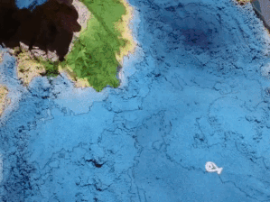
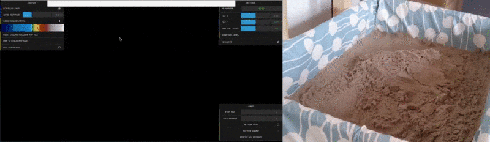

# 🏜️ DuneBox

**An augmented reality sandbox with GPU water simulation.**

> *Like a sandbox, but epic.*

DuneBox is a Windows C++ / OpenFrameworks app that turns a box of sand, a Kinect, and a projector into a live topographic map. Elevation colors and contour lines track the sand at 60 FPS; a GPU shallow-water solver lets rain and lava flow downhill. Shape the land with your hands — the box answers.

By [Max](https://github.com/Manaiakalani) (Manaiakalani).


[](https://github.com/Manaiakalani/DuneBox/actions/workflows/build.yml)
[](https://manaiakalani.github.io/DuneBox-docs/)



## What / Why / Try it

**What.** A Kinect depth camera reads the sand; a short-throw projector paints it back as contours, water, lava, and games. Derived from [Magic-Sand](https://github.com/thomwolf/Magic-Sand) and [SARndbox](https://github.com/KeckCAVES/SARndbox). Kinect v1/v2 on Windows; procedural terrain when no sensor is plugged in.

**Why.** Research AR sandboxes are powerful and hard to run. DuneBox is the GPU-water sibling you can install from a script, calibrate in an afternoon, and leave on for a classroom or a Saturday at home — and still open the shaders when you want to change how the water moves.

**Try it / Docs.**

- **[Live docs](https://manaiakalani.github.io/DuneBox-docs/)** — hardware, physical build, setup, calibration, troubleshooting
- **[DuneBox-docs](https://github.com/Manaiakalani/DuneBox-docs)** — the same guide as a repo, plus `setup-windows.ps1`
- **[Latest release](https://github.com/Manaiakalani/DuneBox/releases/latest)** — pre-built Windows app (`Magic-Sand.exe`)
- Or double-click **`run.bat`** in this repo (see [Quick Start](#quick-start))

## Demo

The clip above is the live projection: a topographic color map and a fish, painted onto the sand.

Chessboard auto-calibration lining up the Kinect and the projector:



A typical physical setup — box, Kinect, and projector. These stills are from the upstream [Magic-Sand](https://github.com/thomwolf/Magic-Sand) project that DuneBox is derived from:


## Features

- **Topographic mapping** — real-time contour lines and elevation color coding at 60 FPS
- **GPU water simulation** — shallow-water equations (Saint-Venant) solved via RK2 integration on GPU
- **Rain gesture** — wave your hand above the sand to make it rain; water flows downhill realistically
- **Interactive games** — fish, sharks, island shaping, and more
- **Auto-calibration** — chessboard-based projector-Kinect alignment
- **No-Kinect mode** — procedural terrain for development/testing without hardware

## Hardware Requirements

| Component | Recommendation |
|---|---|
| **Depth Sensor** | Kinect v2 (Windows default) or Kinect v1 |
| **Projector** | Short-throw, 4:3 aspect, HDMI output |
| **PC** | x86 quad-core + Nvidia GPU for water sim (Quadro P620 minimum) |
| **Sandbox** | 40"×30" plywood box (4:3 ratio), Sandtastik White Play Sand |

## Supported Sensors

| Sensor | `kinectVersion` | Addon Required | Depth Resolution | Compile Flag |
|---|---|---|---|---|
| Kinect v1 (Xbox 360) | `1` | ofxKinect (built-in) | 640×480 | — |
| Kinect v2 (Xbox One) | `2` (committed default) | ofxKinectForWindows2 + Kinect for Windows SDK 2.0 | 512×424 | `DUNEBOX_USE_KINECT_FOR_WINDOWS2` |
| Azure Kinect DK | `3` | **not supported in this binary** | — | — |
| Orbbec Femto Bolt | `3` | **not supported in this binary** | — | — |

### Switching sensors

Edit `bin/data/settings/kinectProjectorSettings.xml` and add/change:
```xml
<kinectVersion>2</kinectVersion>
```

Values: `1` = Kinect V1, `2` = Kinect V2. `3` (Azure / Femto) is refused at startup.

> **The pre-built Windows release already includes Kinect v2 support.** To use a
> Kinect v2 on Windows: install the [Kinect for Windows Runtime 2.0](https://www.microsoft.com/download/details.aspx?id=44559)
> (or the full SDK), connect the sensor via its powered adapter to a **USB 3.0**
> port, set `<kinectVersion>2</kinectVersion>` in
> `bin/data/settings/kinectProjectorSettings.xml`, and launch. No rebuild needed.

### Building with Kinect V2 support (Windows)
The Windows CI build links Kinect v2 automatically. To reproduce locally:
1. Install the [Kinect for Windows SDK 2.0](https://www.microsoft.com/download/details.aspx?id=44561)
   (sets the `KINECTSDK20_DIR` environment variable).
2. Clone [ofxKinectForWindows2](https://github.com/elliotwoods/ofxKinectForWindows2)
   into `openFrameworks/addons/`.
3. Add `ofxKinectForWindows2` to `addons.make`.
4. Add `DUNEBOX_USE_KINECT_FOR_WINDOWS2` to the project's preprocessor definitions.
5. Regenerate the project (projectGenerator) and rebuild.

Azure Kinect / Orbbec Femto Bolt (`kinectVersion=3`) is **not supported** in the current Windows binary. Use sandcam for those sensors.

## Quick Start

### Windows (easiest — no build tools needed)
```powershell
# One-line setup (run as admin):
Set-ExecutionPolicy Bypass -Scope Process -Force
git clone https://github.com/Manaiakalani/DuneBox-docs.git
cd DuneBox-docs\scripts; .\setup-windows.ps1
```
This downloads the pre-built app, creates desktop shortcuts, and you're done.

Or manually: clone this repo and double-click **`run.bat`** — it auto-downloads the latest release.

> **Prerequisite:** the pre-built app needs the [Microsoft Visual C++
> Redistributable (x64)](https://aka.ms/vs/17/release/vc_redist.x64.exe). If it's
> missing, `Magic-Sand.exe` exits immediately with `0xC0000135`
> (`STATUS_DLL_NOT_FOUND`). Install it with `winget install Microsoft.VCRedist.2015+.x64`
> (the `setup-windows.ps1` script handles this for you).

### Put it on your desktop
Double-click **`Install Desktop Shortcut.cmd`** once to add a **DuneBox
(Magic-Sand C++)** icon to your desktop, then launch it with a double-click.
The installer is safe to re-run. (If you also have the `DuneBox-sandcam` repo
checked out, its `Install Desktop Shortcuts.cmd` sets up both apps at once.)

### Build from source (if you want to modify the code)
This repo ships **no IDE project files** — generate them with
OpenFrameworks' projectGenerator.

> **Git LFS:** the reference map imagery under `bin/data/` is stored with
> [Git LFS](https://git-lfs.com). Install it (`git lfs install`) before cloning
> so those assets download as real files rather than pointer stubs.
```powershell
# 1. Install OpenFrameworks 0.12.0 from openframeworks.cc (VS release)
# 2. Clone this repo into  openFrameworks/apps/myApps/Magic-Sand
#    (keep the folder name "Magic-Sand" so the binary is Magic-Sand.exe)
# 3. Install community addons into openFrameworks/addons/:
#      ofxCv, ofxParagraph, ofxModal, and the thomwolf fork of ofxDatGui
#      (ofxKinect, ofxOpenCv, ofxXmlSettings ship with OpenFrameworks)
# 4. Run projectGenerator (import the folder) -> open the generated
#    Magic-Sand.sln -> x64 Release -> Build
```
> The CI workflow (`.github/workflows/build.yml`) is the reference for the exact
> addon pins and build flags. It builds and releases on **Windows** (MSVC, via
> projectGenerator). Windows is the only supported platform.

Press **`w`** to toggle water simulation. Works without a Kinect (test terrain fallback).

## Project Structure

```
DuneBox/
├── src/
│   ├── ofApp.cpp/h               # Main application
│   ├── KinectProjector/           # Kinect depth processing + calibration
│   ├── SandSurfaceRenderer/       # Topographic color map + contours
│   ├── WaterSimulation/           # GPU water sim (extracted from SARndbox)
│   └── Games/                     # Interactive creatures & games
├── bin/data/shaders/water/        # GLSL water simulation shaders
│   ├── adapted/                   # GLSL 150 core-profile adapted shaders
│   └── SHADER_ANALYSIS.md         # Shader pipeline documentation
└── docs/
    └── RENDER_PIPELINE_ANALYSIS.md
```

## Water Simulation

The water simulation uses GLSL shaders extracted from [SARndbox](https://github.com/KeckCAVES/SARndbox) and adapted to run cross-platform via OpenFrameworks `ofFbo` multi-pass rendering.

**Pipeline (per frame):**
1. Bathymetry update (sync terrain with Kinect depth)
2. Slope + flux + derivative computation (Kurganov-Petrova scheme)
3. Euler predictor step (RK2)
4. Recompute derivatives at predicted state
5. Runge-Kutta corrector step
6. Boundary enforcement
7. Rain addition (hand gesture) + evaporation
8. Water color rendering + compositing

## Keyboard Controls

| Key | Action |
|---|---|
| `w` | Toggle water simulation on/off |
| `l` | Toggle lava simulation (auto-switches to Volcanic theme) |
| `t` | Cycle color themes (Topo → Ocean → Volcanic → Ice Age → Alien) |
| `n` | Toggle day/night cycle |
| `v` | Trigger volcano eruption at center |
| `b` | Send ping to Python bridge |
| `space` | Start map game (if idle) / advance game step / start app from setup |
| `f` or `r` | Start fish game (boid mode 2) / end map game |
| `1`–`4` | Start boid game at difficulty 0–3 |
| `m` | Start "seek mother" game |
| `c` | Save Kinect color image to disk |
| `d` | Save filtered depth image to disk |
| `T` | Run real-time test (debug) |
| `W` | Run debug test |

## Documentation

| Link | What you get |
|---|---|
| **[Live docs](https://manaiakalani.github.io/DuneBox-docs/)** | Hardware, construction, software setup, calibration, troubleshooting, classroom and kiosk notes |
| **[DuneBox-docs](https://github.com/Manaiakalani/DuneBox-docs)** | Source for that site, plus Windows setup scripts |
| **[Render pipeline](docs/RENDER_PIPELINE_ANALYSIS.md)** | How depth becomes color on the sand |
| **[Water shaders](bin/data/shaders/water/SHADER_ANALYSIS.md)** | SARndbox shader port and GPU pass list |
| **[DuneBox-sandcam](https://github.com/Manaiakalani/DuneBox-sandcam)** | Python companion: ArUco marker triggers, biome creatures, web dashboard |

The docs site is the complete build guide. This README is the C++ app: sensors, keys, water pipeline, and how to run or rebuild it.

## Credits & Acknowledgments

DuneBox is maintained by **Max** ([Manaiakalani](https://github.com/Manaiakalani)). It builds on the work of the open-source AR sandbox community:

- **[Magic-Sand](https://github.com/thomwolf/Magic-Sand)** by Thomas Wolf & Rasmus R. Paulsen (DTU Copenhagen) — the cross-platform OpenFrameworks AR sandbox this project is derived from. Licensed under GPL-2.0.

- **[SARndbox](https://github.com/KeckCAVES/SARndbox)** by Oliver Kreylos (UC Davis / KeckCAVES) — the original AR sandbox. The water simulation GLSL shaders in `bin/data/shaders/water/` are extracted and adapted from this project. Licensed under GPL-2.0. [Official site](https://arsandbox.ucdavis.edu/)

- **[sARndbox erosion mod](https://github.com/danigeos/sARndbox)** by danigeos — erosion and sedimentation simulation
- **[ARSandbox-Adds](https://github.com/RiverWeyTrust/ARSandbox-Adds)** by River Wey Trust — weather effects (lava, snow)
- [r/arsandbox](https://reddit.com/r/arsandbox) — community subreddit

## License

Licensed under [GPL-2.0](COPYING), inherited from Magic-Sand and SARndbox.
